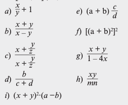

# Día 2

## Operadores I

Los operadores fundamentales son:

- Aritméticos, lógicos y relacionales.
- Condicionales
- Especiales

### Expresiones

Una expresión es una forma de calcular un valor. El conjunto de operaciones básicas de C  (aritméticas) para suma, resta, multiplicación y división, las cuales son las más comunes en la mayoría de los lenguajes de programación.

Las **expresiones** son componentes de declaraciones complejas. Los operadores trabajan en una o mas expresiones, donde una expresión puede ser simple o compleja:

- `5` es una expresión literal que evalúa el valor de `5`.
- `5 + 8` es una expresión aritmética  de dos simples expresiones (constantes literales), los cuales, con el operador de adición, evalúa a `13`.
- Una expresión más compleja, `5 + 8 - 10`, son en realidad dos operaciones aritméticas binarias donde `5` y `8` son evaluados primero para obtener un resultado intermedio, después el `10` es restado a este resultado intermedio.
- 5; es una sentencia de expresión que evalúa a 5 y entonces se mueve a la siguiente sentencia. Una versión más util de esta sería `a_value = 5;` la cual es realmente dos expresiones: la evaluación del 5 y después la asignación del valor a la variable `a_value`.

Un programa simple calc_length.c que aplica cada método de utilizar expresiones simples y complejas, es la siguiente:

```c
#include <stdio.h>

int feet_to_inches( double feet ) 
{
  int inches = feet * 12;
  return inches;
}

int main( void )
{
  int value   = 8; 
  int length  = 0;

  length = 5 + value + feet_to_inches( 3.5 );
  printf( "Calculated length = %d\n" , length );

  length = 5;
  length = length + value;
	length = length + feet_to_inches(3.5);
	print("Calculated length = %d\n", length );
}
```

Compilar el programa y ejecutar para validar

```bash
gcc calc_length.c -o calc_length
./calc_length
```

### Operador de asignación

El operador de asignación =, asigna el valor de la expresión derecha a la variable situada a la izquierda.

```c
code = 3467;
fahrenheit = 123.456;
x_axes = 525;
y_axes = 725; 
```
Este operador es asociativo por la derecha, esto permite realizar asignaciones múltiples, de la siguiente forma:

```c
a = b = c = 45;
// Equivale a 
a = (b = (c = 45));
```

Esto permite inicializar varias variables con una sola sentencia.

```c
int a, b, c;
a = b = c 5;
```

### Operadores aritméticos

Las operaciones aritméticas básicas son:

- Suma `+`
- Resta `-`
- Multiplicación `*`
- División `/`
- Modulo `%`

### Precedencia de operadores

| Operador | Operación | Nivel de procedencia |
| --- | --- | --- |
| () | (5 + 4) * 3 | 1 |
| +, - | +25, -6.745 | 2 |
| *, /, % | 5*5, 25/5 | 3 |
| +, - | 2+3 | 4 |

📌  Determinar el resultado de las siguientes expresiones:

a. `6 + 2 * 3 -4 /2`

b. `5 * ( 5 + (6-2) + 1`

c. `7 - 6 / 3 + 2 * 3 / 2 - 4 / 2`

d. `7 * 10 - 5 % 3 * 4 + 9`

## Ejercicios

1.1. Salida en pantalla

Escribir un programa que imprima su nombre y dirección.

Ejemplo:

```Bash
Nombre: Homero J. Simpson
Dirección: Av. Evergreen 742. Sprinfield, NT 48007. USA.
```

1.2. Salida en texto largo en pantalla

Escribir un programa que imprima una página de texto con no más de 40 caracteres por línea.

Ejemplo:

```Bash
Pass
```

1.3. Letrero

Escribir un programa que imprima las letras UTM con asteriscos.

Ejemplo:

```Bash
*       *   ***********   *           *
*       *        *        * *       * * 
*       *        *        *  *     *  *
*       *        *        *   *   *   *
*       *        *        *    * *    *
*       *        *        *     *     *
*       *        *        *           *  
*       *        *        *           *
  *****          *        *           *
```


2.1. Escribir las siguentes expresiones aritméticas como expresiones de computadora. La potencia puede utilizar la función `pow()`. Ejemplo: $(x + y)^2$ es `pow(x + y, 2)`.



2.2. Escribir un programa que lea un entero, lo multiplique por 2 y a continuación lo escriba de nuevo en la pantalla.

2.3. Escribir un programa que intercambie los valores entre dos variables.

2.4. Escribir un programa que lea dos enteros en las variables `x` y `y`, y a continuación obtenga los valores de:

* La división x entre y
* El residuo de la división de x entre y

2.5. Escribir un programa que **solicite al usuario** la longitud y anchura de una habitación y acontinuación visualice su superficie con cuatro decimales (formto 5.4f).

2.6. Escribir un programa que convierte un número dado en segundos en el equivalente a minutos y segundos.

2.7. Escribir un programa que solicite dos números decimales y calcule su suma, visualizando la suma. Por ejemplo si los números son `57.45` y `425.55`, el program visualizará:

```bash
   57.45
+ 425.55
________
  483.00
```

2.8. Escribir un programa para calcular la longitud de la circunferencia y el área del círculo para un radio introducido por el teclado.

2.9. Escribir un programa que visualice valores como:

```bash
7.1
7.12
7.123
7.1234
7.12345
7.123456
```

2.10 Escribir un programa que lea tres enteros y emite un mensaje que indique si están o no en orden númerico.

2.11. Escribir una sentencia lógica booleana que clasifique un entero `x` en una de las siguientes categorías.
x < 0
0 <= x <= 100
x > 100

2.12. Escribir un programa que introduzca un número de un mes (1 al 12) y visulice el número de días de ese mes.

2.13. Escribir un programa que lea dos números y visualice el mayor, utilizar el operador ternario `?:`

2.14. El domingo de Pascua es el primer domingo después de la primera luna llena porterior al equinoccio de primavera, y se determina mediante el siguiente cálculo sencillo:

```bash
A = año % 19
B = año % 4
C = año % 7
D = (19 * A + 24) % 30
E = (12 * B + 4 * C + 6 * D + 5) % 7
N = (22 + D + E)
```

donde `N` indica el número de día del mes de marzo (si `N` es igual o menor que 31) o abril (si es mayor que 31). Construir un programa que tenga como entrada un año y determine la fecha del domingo de Pascua.

Nota: No utilizar el valor ternario para  seleccionar.

2.15. Determinar si el carácter asociado a un código introducido por el teclado corresponde a un carácter alfabético, dígito, de puntuación, especial o no imprimible.

## Problemas

2.16. Escribir un programa que lea dos enteros de tres dígitos y calcule e imprima su producto, cociente y el resto cuando el primero se divide entre el segundo. La salida será justificada a la derecha.

2.17. Una temperatura Celsius puede ser convertidad a una temperatura equivalente F de acuerdo con la siguinte fórmula: 

Escribir un programa que lea la temperatura en Celsius y la escriba en F.

2.18. Un sistema de ecuaciones lineas

se puede resolver con las siguiente fórmulas:

Diseñar un programa que lea dos conjuntos de coefiencientes (a, b y c; d, e y f) y visualice los valores de `x` y `y`.

2.19. Escribir un programa que dibuje el rentángulo siguiente:

```bash
* * * * * * * * * * * * 
*                     *
*                     *
*                     *
*                     *
* * * * * * * * * * * * 
```

2.20. Modificar el programa anterior (2.19), de modo que se lea una palabra de cinco letras y se impriman en el centro del rectángulo.

2.21. Escribir un programa que lea dos números y visualice el mayor.

2.22.  página 122 